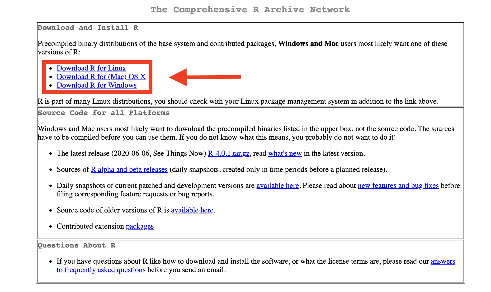
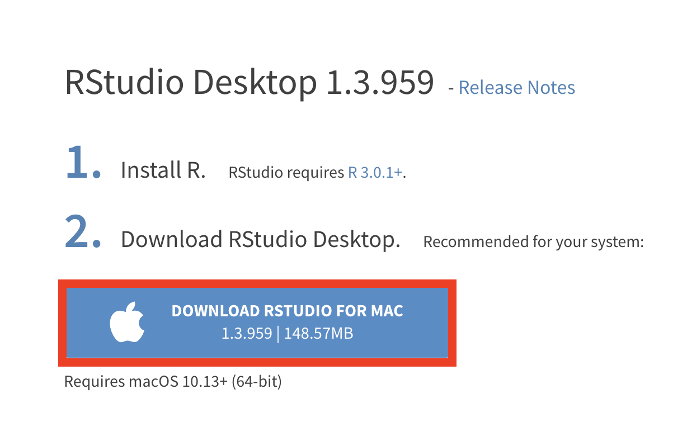
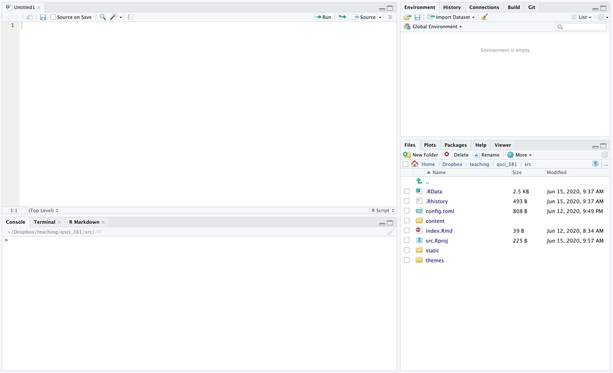
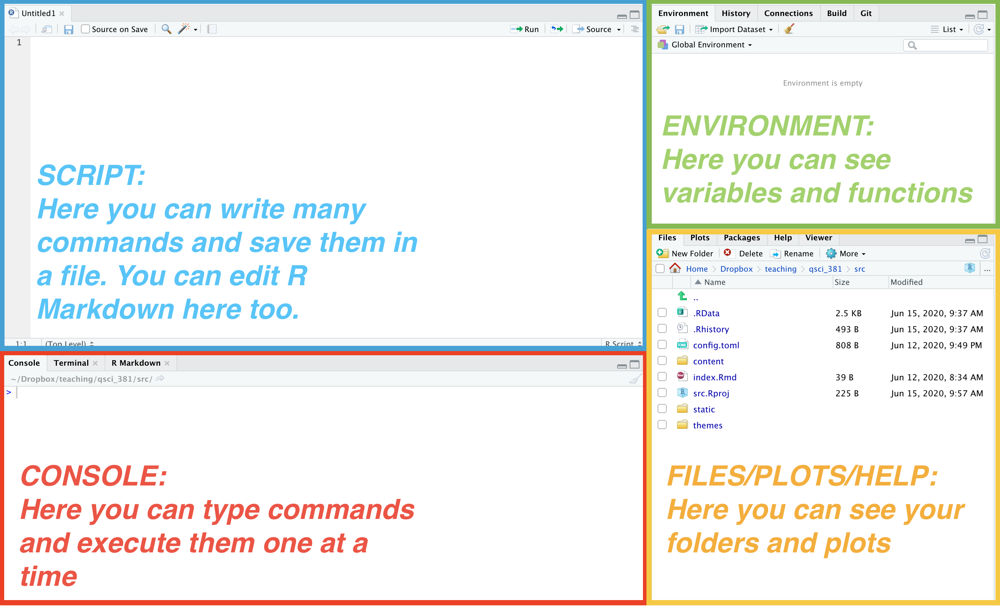
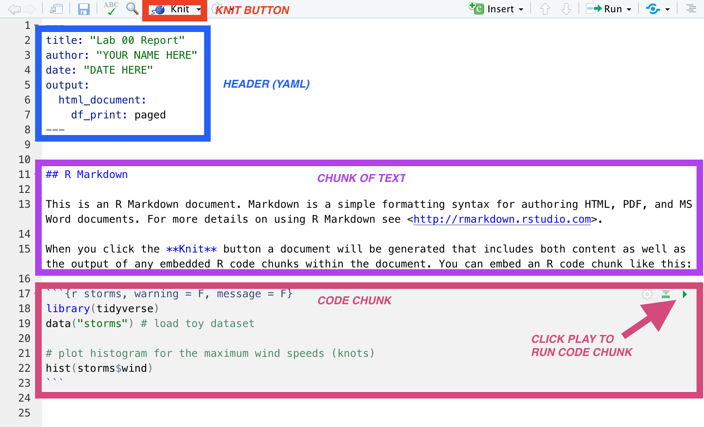

class: middle

Most the instructions here are taken from Chapter 1 of [*Getting Used to R, RStudio, and R Markdown*](https://rbasics.netlify.app/) by Ismay and Kennedy and [this associated tutorial](https://www.reed.edu/data-at-reed/software/R/r_studio.html). See also Chapter 1 of [*Statistical Inference via Data Science*](https://moderndive.com/index.html) by Ismay and Kim. 

<br>
Before your first lab section, you should follow the steps below to install R, RStudio, and R Markdown. 

<br>
To keep things brief, I have put explanations of why we want to use these tools at the end of these instructions. 

---
#### 1. Download and install R by going to https://cloud.r-project.org.

```{r, echo = F, out.width="90%", fig.align='center'}

```
---
#### 1. Download and install R by going to https://cloud.r-project.org.

<br>

  * **If you are a Windows user**: Click on “**Download R for Windows**”, then click on “base”, then click on the Download link.

<br>

  * **If you are a macOS user**: Click on “**Download R for (Mac) OS X**”, then under “Latest release:” click on R-X.X.X.pkg, where R-X.X.X is the version number. For example, the latest version of R as of June 12, 2020 was R-4.0.1.
  
<br>
  
  * **If you are a Linux user**: Click on “**Download R for Linux**” and choose your distribution for more information on installing R for your setup.
---
#### 2. Download and install RStudio at https://rstudio.com/products/rstudio/download/#download.

```{r, echo = F, out.width="90%", fig.align='center'}

```
---
class: middle
#### 2. Download and install RStudio at https://rstudio.com/products/rstudio/download/#download.

  * Click the button that says “**Download R for xxxx**,” referring to your computer's operating system. Run the installer program.
---
#### 3. Now, open RStudio on your computer. You should see a window that looks like this.

```{r, echo = F, out.width="90%", fig.align='center'}

```
---
#### 4. Your RStudio window is typically divided into four panes, as shown below. Find the console pane.

```{r, echo = F, out.width="90%", fig.align='center'}

```
---

<br>
<br>

####5. Copy and paste the following line into the console

```{r hello, eval = F}
install.packages("tidyverse")
```

and then press Enter/Return to run your first line of code!

<br>
Follow the instructions and answer yes if prompted. 

<br>
This line of code will install some helpful "**packages**," which you can think of as **upgrades to R**. These packages include additional functions and tools that we will use this quarter. 

<br>
**6. Now, close and reopen RStudio to finish installing your packages.**

---
class: inverse, center, middle

# Compiling your first lab report

---
class: middle
When you write your lab reports this quarter, you are **recommended but not required to use** R Markdown, a tool that makes it easy to combine code and output in one document. In this section we will make sure R Markdown works on your computer and practice compiling a lab report. 

<br>
#### 7. First, download the <a href="https://raw.githubusercontent.com/QSCI381-SUM20/QSCI381-SUM20.github.io/master/post/lab-00/lab_00_template.Rmd"><b>Lab 00 Template</b></a> and open it in RStudio.
---
When you open the file, it should appear in the Script pane. Hopefully, it looks something like this:

<br>
```{r, echo = F, out.width="90%", fig.align='center'}

```

---
#### 8. Put your name and the date in the appropriate places in the header.

<br>
You should also see a block of code that looks like this:
````markdown
`r ''````{r storms, eval = F}
    library(tidyverse)
    data("storms") # load toy dataset
    
    # plot histogram for the maximum wind speeds (knots)
    hist(storms$wind)
```
````


<br>
This is called a **code chunk**. R Markdown is helpful because you can include code and text together.

<br>
**Try running each line of code, one at a time, in the console.** Equivalently, click **Knit** to run all code in your .Rmd file at once. This should produce a **.html** file of your lab report. Submit this html file on Canvas. You have now finished Lab 00!

---
class: middle

We'll talk more about the details of all of this, but for now, it is enough that you installed R and checked that R Markdown works. If you are interested, see the next few slides.

---
class: middle

# [Tell me why](https://www.youtube.com/watch?v=4fndeDfaWCg)

---
class: middle
### Why R?

"R is an open-source programming language that has seen its popularity grow tremendously in recent years, with developers adding new functionality via packages on a daily basis." (Ismay and Kennedy, 2019).

Broadly speaking, you should think of R as a fancy calculator. You give R specific commands (in the language of code), and R will follow your instructions.
---
class: middle
### Why RStudio?

"RStudio is a graphical development environment that makes it easier to write and view the results of R code" (Ismay and Kennedy, 2019).

RStudio makes it easier to collect all your R commands into a single file, or script. By saving your script, you can create a record of everything you told the computer to do. RStudio also makes it easy to write reports with R Markdown and to work on plots/figures.

---
class: middle
### Why R Markdown?

"R Markdown provides an easy way to produce rich, fully-documented, reproducible analyses" (Ismay and Kennedy, 2019).

Instead of copying/pasting code and figures into a Word document, you can use R Markdown to combine text, code, and figures in one unified document. There is a learning curve, but once you get the hang of using R Markdown, you can create reports that clearly communicate how you conducted your statistical analyses.
