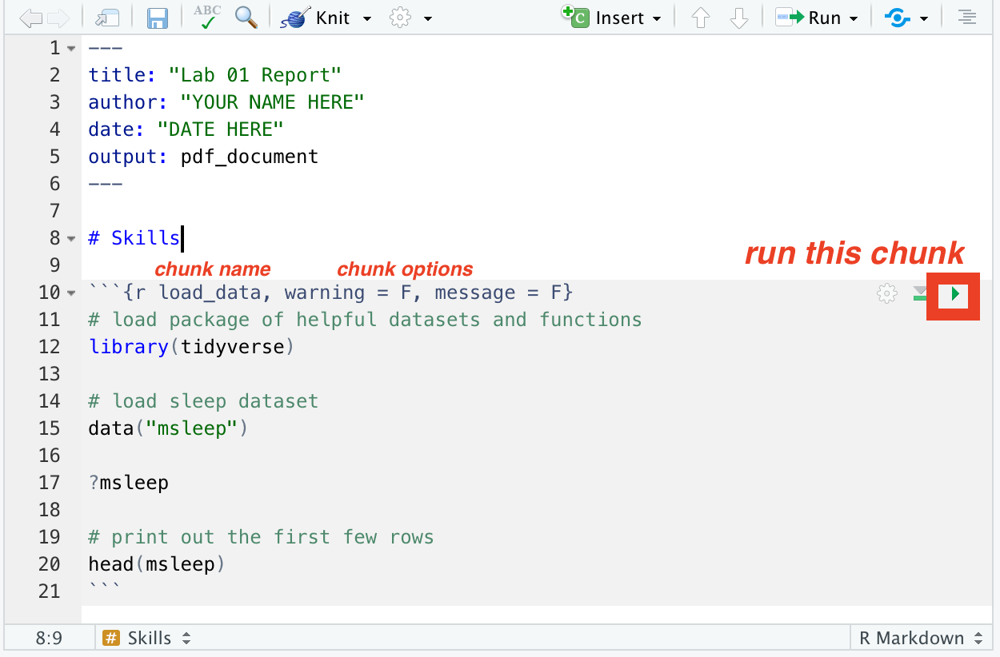
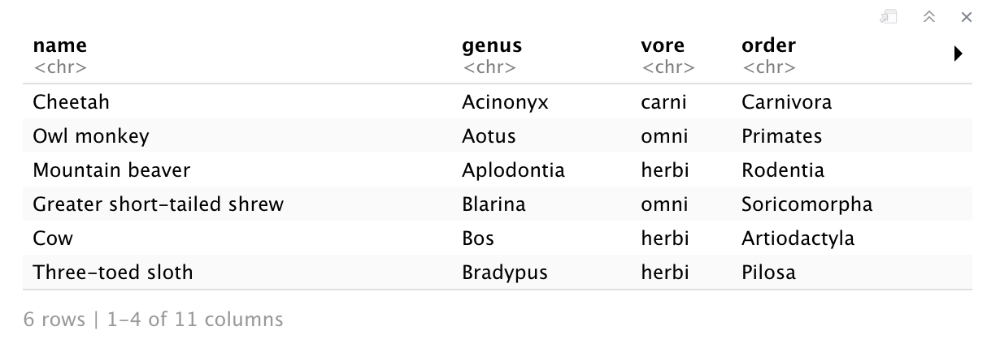
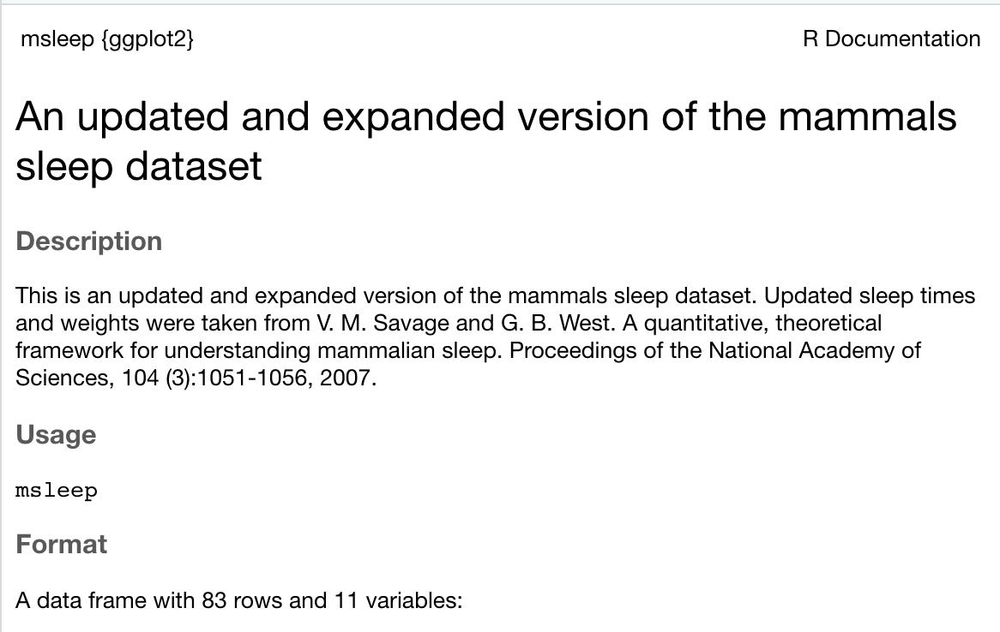

class: middle

    In R Markdown files, you can switch between text and code. This line is text, but below is a code chunk. In your template file, the first code chunk has the name `load_data` and the options `warning = F, message = F`. Within the code chunk, we have lines of code. The lines that start with `#` are **comments**, which R ignores when running the code chunk. You can and should write comments to help you remember what your code does.

---
class: middle, center

```{r, echo = F, out.width="90%", fig.align='center'}
    
```
---
class: middle

#### **2. Click the green play button to run the chunk.** 

This chunk will load the `msleep` dataset and then print out the first few rows.

The `msleep` dataset is a **data frame**, a table where each row corresponds to a particular mammal, and each column is a different variable. 


```{r load_data, warning = F, message = F, include = F}
# load package of helpful datasets and functions
library(tidyverse)

# load sleep dataset 
data("msleep")

# print out the first few rows
head(msleep)
```
---
class: middle

After you run the chunk, you should see something like the table below.

```{r, echo = F, out.width = "90%"}

```
---
class: middle
#### 3. Next, to get more info about the dataset, copy, paste, and run the following line of code in the console.
```{r, eval = F}
?msleep
```
---
class: middle
#### 4. You should be able to see the help entry in the help pane:

```{r, echo = F, out.width="80%", fig.align='center'}

```
---
class: middle
This dataset provides information about different mammals' sleep habits. 

#### 5. First let's calculate the average hours of sleep for all the mammals in our dataset using the following R command.
```{r}
mean(msleep$sleep_total)
```

The `mean()` function computes the arithmetic mean, `msleep` refers to our data frame, and `$sleep_total` tells R we only the `sleep_total` column.

---
class: middle

#### 6. Let's also compute the mean body weight and brain weight in kilograms:
```{r}
mean(msleep$bodywt)
mean(msleep$brainwt)
```
---
class: middle
When we tried to compute the brain weight, we got `NA` because we don't have brain weight data for all the animals. 

#### 7. Let's try again, but this time, we'll tell R to ignore the NAs, setting the `na.rm` argument to TRUE to remove all `NA` values before computing the mean. 

This time you should get a numerical answer.
```{r}
mean(msleep$brainwt, na.rm = TRUE)
```

---
class: middle
#### 8. Let's also try calculating some other descriptive statistics like medians and standard deviations. How can we interpret these values?

```{r}
median(msleep$sleep_total)
sd(msleep$sleep_total)
```
---
class: middle

#### 9. Finally, let's make some basic plots. The following command makes a histogram of the `sleep_total` variable, which gives us the frequency of different amounts of sleep. 
```{r out.width = "80%", fig.asp = .65, fig.align = "center"}
hist(msleep$sleep_total)
```

---
class: middle
#### 10. The x-axis label is not very helpful, and neither is the title, so let's change those.

```{r out.width = "80%", fig.asp = .65, fig.align = "center"}
hist(msleep$sleep_total, xlab = "Average hours of sleep", 
     main = "Average hours of sleep for mammals")
```

---
class: middle
#### 11. Let's also make a scatter plot to compare brain weight and body weight.

Here, the first argument of the plot function is `brainwt~bodywt`. This is called a **formula** in R. 

In general, formulas in R take the form ````[RESPONSE VARIABLE NAME]~[EXPLANATORY VARIABLE NAME]`, and they come in handy when we have a response varaiable and an explanatory variable. 

The `data = msleep` argument tells `plot` where to find the variables.

```{r out.width = "75%", fig.asp = .5, fig.align = "center"}
plot(brainwt~bodywt, data = msleep,
     ylab = "Brain weight (kg.)",
     xlab = "Body weight (kg.)")
```
---
class: middle

It's hard to see much of anything! Some of these mammals are much heavier than others. 

#### 12. Something we could try is to take the logarithm of brain weight and  the logarithm of body weight, and plot those variables. We'll talk more about when this is appropriate later in the course. Do you think the plot below is "better" than the original plot? Why or why not?

```{r out.width = "75%", fig.asp = .5, fig.align = "center"}
    plot(log(brainwt)~log(bodywt), data = msleep,
         ylab = "log(Brain weight)",
         xlab = "log(Body weight)")
```
---
class: middle

It's hard to see much of anything! Some of these mammals are much heavier than others. 

#### 13. Finally, let's play around with changing the points' shapes and colors.

```{r out.width = "75%", fig.asp = .5, fig.align = "center"}
    plot(log(brainwt)~log(bodywt), data = msleep,
         ylab = "log(Brain weight)",
         xlab = "log(Body weight)",
         pch = 16, col = 'red')
```


