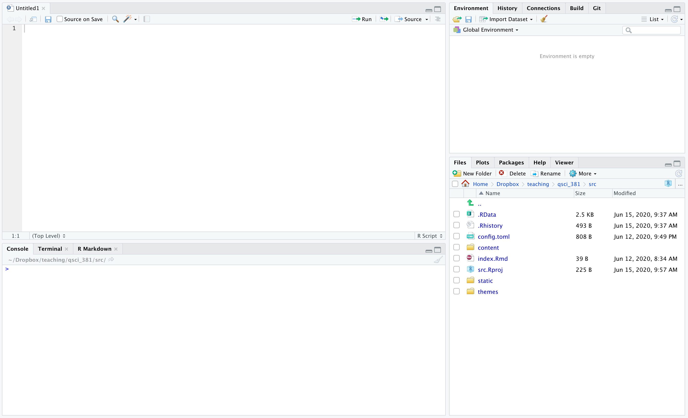

class: middle

- Ask for help early and often. Work with classmates on labs. If you are interested in joining a study group

- The Internet is your friend. I had to look up basically everything in this presentation because I don't have it memorized.

- Be patient with yourself. You don't need to understand every single line of code in this class to be successful.

---
class: inverse, center, middle

# *introducing R*
---
class: middle
## *R*

R is a programming language designed for statistics and data analysis.

### Why R?

- it's free
- open-source
- designed for working with different types of data
- many **packages** for specialized analysis

---
class: middle
## *RStudio*

RStudio is a program (like Microsoft Word) designed to streamline work with R.

### Why RStudio?

- it's free
- open-source
- puts your code, figures, console, etc. all in one place
- provides helpful **syntax highlighting**

---
#### <span style="background-color:#7affdb">Open RStudio</span> on your computer. You should see a window that looks like this.

```{r, echo = F, out.width="90%", fig.align='center'}

```
---
#### Your RStudio window is typically divided into four panes, as shown below. Find the console pane.

```{r, echo = F, out.width="90%", fig.align='center'}
knitr::include_graphics("../img/01_rstudio_annot.png")
```
---
class: middle
## Console

Think of the console as an exceptionally fancy calculator. Using the console, you give your computer directions, in the form of lines of code. Try typing these lines into the console:

```{r}
# Addition
2 + 2
```

```{r}
(2 + 2) * 3
```
---
## Basic R commands
```{r}
# Subtraction
2 - 2
```

```{r}
# Multiplication
1 * 3
```

```{r}
# Division
4 / 2
```
---
## Assigning variables

We can also tell the computer to save **variables** using the ````<-```` or ````=```` operation. Let's save the number 2 in the object ````my_first_variable````.

```{r}
my_first_variable <- 2
```
Nothing is printed when we do this. However, we can **reference** the object we created later.

```{r}
my_first_variable
```

We can also replace the value of our object with a new value. These values don't have to be numbers:

```{r}
my_first_variable <- "hello"
my_first_variable
```
---

## Comparisons

We can also use R to compare values:

```{r}
# greater than
2 > 2
# greater than or equal to
2 >= 2
```

```{r}
# equal
1 == 3
```

---

## Comparisons

We can also use R to compare values:

```{r}
# greater than
2 > 2
# greater than or equal to
2 >= 2
```

```{r}
# equal
1 == 3
```

---

## R Functions

Besides basic **operators**, R also provides **functions**:

```{r}
# pi is a constant in R
pi
# sine function -- be careful with numbers that are very close to zero!
sin(2 * pi)
sin(0)
```

---
## R Functions

Besides these basic **operators**, R also provides **functions**:

```{r}
print("hello")
new_variable <- "hello"
```
We can explicitly use `print` to display an variable's contents:
```{r}
print(new_variable)
```
By default, if we only give R a variable name, it will print its contents:
```{r}
new_variable
```

---
class:middle

## R Functions

What happens if an object has not been defined yet?

```{r, error = T}
print(the_answer)
```

---
## Basic data types

R has a few basic types of values, including

```{r}
# numeric
class(2)
# character
class("hello")
# logical
class(TRUE)
```

---
## Vectors

We can combine multiple **scalars** into a **vector** using the **concatenate** function `c()`:

```{r}
scalar_1 <- 4
scalar_2 <- 3
my_first_vector <- c(scalar_1, scalar_2)
print(my_first_vector)
``` 

Our `my_first_vector` is a vector of length two:
```{r}
length(my_first_vector)
```
---
## Vectors
We can access the element in slot i of our vector using the notation `my_second_vector[i]`
```{r}
my_second_vector <- c(4, 5)
print(my_second_vector[1])
print(my_second_vector[2])
```
---
## Vector functions
We can apply some functions to vectors:
```{r}
my_third_vector <- c(4, 5, 6, 7, 8)
sum(my_third_vector)
```
Which can save us a lot of time:
```{r}
my_fourth_vector <- c(1:50)
my_fourth_vector
sum(my_fourth_vector)
```
---
class:middle
## Matrices

Matrices are like 2D vectors: we define them by giving a vector of values and a set of dimensions:
```{r}
my_first_matrix <- matrix(c(1,2,3,4), nrow = 2, ncol = 2)
print(my_first_matrix)
```
---
class:middle
## Matrices

We access the element in the ith row and jth column of our vector using the notation `my_first_matrix[i, j]`
```{r}
print(my_first_matrix[1, 1])
```
We access all element in the ith row using the notation `my_first_matrix[i, ]`
```{r}
print(my_first_matrix[1, ])
```
---
class:middle

## Data frames

Matrices are only allowed to hold one type of data (such as numeric data). We will want to work with multiple types of data at once, which we can do with **data frames**.

Each column of a **data frame** can hold a different type of data
```{r}
my_first_df <- data.frame(name = c("Barry", "Lulu"),
                          age = c(6, 7), stringsAsFactors = F)
print(my_first_df)
```
---
class:middle
## Data frames
Each column of a data frame needs to have a name, and we can access different columns of the data frame using `$`:

```{r}
my_first_df <- data.frame(name = c("Barry", "Lulu",
                                   "Agnes", "Edward"),
                          age = c(6, 7, 6, 8),
                          stringsAsFactors = F)
my_first_df$name
my_first_df$age
```
---
class:middle
## Data frames
Each column of a data frame needs to have a name, and we can access different columns of the data frame using `$`:

```{r}
my_first_df <- data.frame(name = c("Barry", "Lulu", 
                                   "Agnes", "Edward"),
                          age = c(6, 7, 6, 8), 
                          stringsAsFactors = F)
my_first_df$name
my_first_df$age
```

---
## Subsetting

Some times we may want to take a subset our data. Suppose we want to look only at the rows of data for six-year-olds in `my_first_df`:
```{r}
my_first_df <- data.frame(name = c("Barry", "Lulu",
                                   "Agnes", "Edward"),
                          age = c(6, 7, 6, 8), 
                          stringsAsFactors = F)
my_first_df[my_first_df$age == 6, ]
```

---
class:middle
## Loading data

Naturally, you want to get your data into R so you can start working with it. We'll talk more about this, but for now we'll work with built-in datasets:
```{r}
# load the mtcars dataset
data(mtcars)
# print the first few rows of data
head(mtcars)
```
---
class:middle
## Plotting data

Let's plot the miles per gallon `mpg` against the number of cylinders `cyl`.
```{r, out.width = "60%", fig.asp= 0.75, fig.align = "center"}
plot(mtcars$mpg, mtcars$cyl)
```
---
class:middle
## Plotting data

We can change various options to make plots more readable:
```{r, out.width = "60%", fig.asp= 0.75, fig.align = "center"}
plot(mtcars$mpg, mtcars$cyl, 
     xlab = "Miles per gallon", 
     ylab = "Cylinders", pch = 16, col = 'red')
```
---
class:middle
## Tidyverse

Up to now, we have been using functions that automatically come with **R**. In Lab 00, you installed `tidyverse`, which provides a unified set of packages for data analysis and cleaning. Some people find this more readable/easy to learn. I'll use a little of both.
---
## Tidyverse

For example, let's see how to take a subset of our data using `tidyverse` functions:

```{r, warning = F, message = F}
library(dplyr) # load a tidyverse package
my_first_df <- data.frame(name = c("Barry", "Lulu",
                                   "Agnes", "Edward"),
                          age = c(6, 7, 6, 8), 
                          stringsAsFactors = F)
my_first_df %>%
  filter(age == 6)
```
which we can compare with the **base R** code
```{r}
my_first_df[my_first_df$age == 6, ]
```

---

## Plotting with ggplot2

Many people who code with `tidyverse` functions make plots with the `ggplot2` package. Again, you can use whichever package you feel comfortable with. We'll often use `ggplot2`.

Recall the **base R** plotting code:
```{r, out.width = "45%", fig.asp= 0.75, fig.align = "center"}
plot(mtcars$mpg, mtcars$cyl, 
     xlab = "Miles per gallon", 
     ylab = "Cylinders", pch = 16, col = 'red')
```

---
## Plotting with ggplot2

Compare with ggplot2 code:
```{r, out.width = "45%", fig.asp= 0.75, fig.align = "center"}
library(ggplot2) # load ggplot2 package
ggplot(mtcars, aes(x = mpg, y = cyl)) + 
  geom_point(col = 'red')
```

---
class:middle
## Tidyverse and ggplot2

Don't worry about knowing how to use `tidyverse` or `ggplot2` packages for now, just be aware that they exist and often provide alternative ways to do things in R

---
class:middle
## General R Tips

- Use comments often to remind yourself what you did and to explain your code to others
- R is case-sensitive so `y` is not the same as `Y`.
- Spaces do not mean anything in your code: `1+1` is the same as `1 +     1`
- Variable names must start with letters

There is a lot more to learn, of course, but hopefully this will be enough to get you started with R.
---
## Script/source pane

```{r, echo = F, out.width="90%", fig.align='center'}
knitr::include_graphics("../img/01_rstudio_annot.png")
```

---
class:middle
## Script/source pane

You can do everything in the console, but if you want to run more than a couple lines of code at once, you will want to write a **script**. The script pane is where you can write and save multiple lines of code. 

---
class:middle
## R Markdown

In your lab reports, you'll have to submit figures generated by R, your written answers to lab questions, and R code. One convenient way to put all these things together is R Markdown. 

---
## Example R Markdown file

```{r, echo = F, out.width="90%", fig.align='center'}
knitr::include_graphics("../img/00_template.png")
```

---
class:middle
## R Markdown

We'll provide a template file for each lab if you want to submit your work using R Markdown, but you can feel free to use Word or other software, as long as your work is **well-organized** and **easily readable**.
